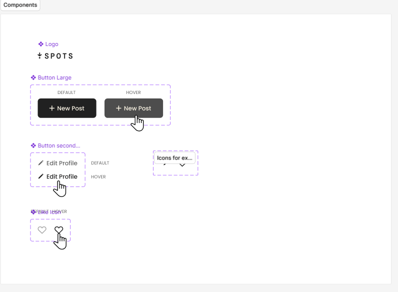

# Project 3: Spots

### Overview

**Intro**

This is a responsive website layout for an interactive social media web application called '**Spots**', where users can add and remove photos, like photos of other users, and make a few minor adjustments to their profile. This project based off figma design linked below for mobile (320px) and desktop (1440px) using HTML & CSS.

**Figma Link**

- [Link to the project on Figma](https://www.figma.com/design/BBNm2bC3lj8QQMHlnqRsga/Sprint-3-Project%3A-Spots?node-id=2-60&t=xL5ykCZhfigpk8xW-0)

**Images**

**GitHub Pages Link**

- [Link to github repo](https://j-magee0.github.io/se_project_spots/)
